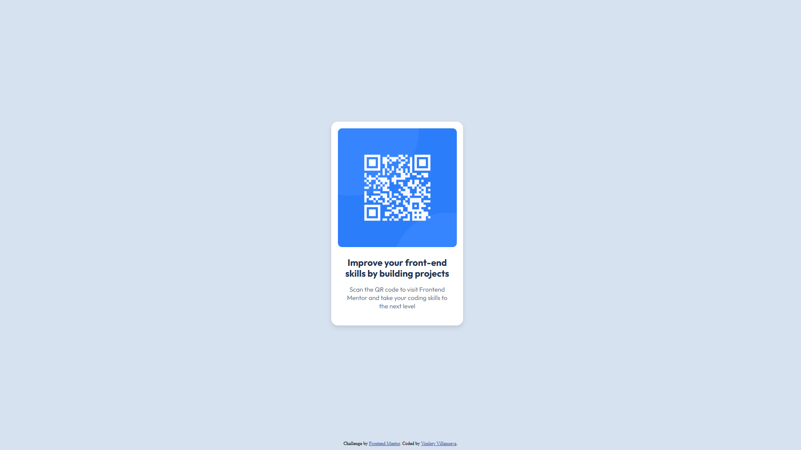
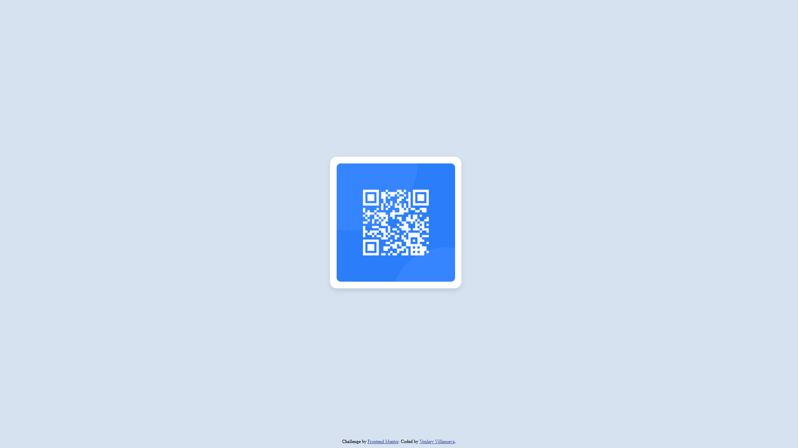

# Frontend Mentor - QR code component solution

This is a solution to the [QR code component challenge on Frontend Mentor](https://www.frontendmentor.io/challenges/qr-code-component-iux_sIO_H). Frontend Mentor challenges help you improve your coding skills by building realistic projects.

## Table of contents

-   [Overview](#overview)
    -   [Screenshot](#screenshot)
    -   [Links](#links)
-   [My process](#my-process)
    -   [Built with](#built-with)
    -   [What I learned](#what-i-learned)
    -   [Continued development](#continued-development)
    -   [Useful resources](#useful-resources)
-   [Author](#author)
-   [Acknowledgments](#acknowledgments)

## Overview

QR code component activity that uses html/css with pseudo classes such as hover & active.

### Screenshot

### Links

-   Solution URL: [Add solution URL here](https://github.com/bonlery/Frontend-Mentor---QR-code-component)
-   Live Site URL: [Add live site URL here](https://bonlery.github.io/Frontend-Mentor---QR-code-component/)

## My process

    Used the figma file for initial measurements.
    Developed the html.
    Styled with css.

### Built with

-   Semantic HTML5 markup
-   CSS custom properties
-   Flexbox
-   CSS pseudo classes
-   Figma measurements

### What I learned

    Basics of figma, html, and css.

### Continued development

I'll be using this activity and recreate it using ReactJS with Tailwind CSS, wish me good luck.

### Useful resources

-   [Flexbox](https://www.youtube.com/watch?v=phWxA89Dy94) - This helped me with the behavior of flexbox.
-   [Animation](https://www.youtube.com/watch?v=SgmNxE9lWcY) - This helped me with animation.

## Author

-   Website - [Vonlery Villanueva](https://github.com/bonlery)
-   Frontend Mentor - [@bonlery](https://www.frontendmentor.io/profile/bonlery)

## Acknowledgments

    none yet.
